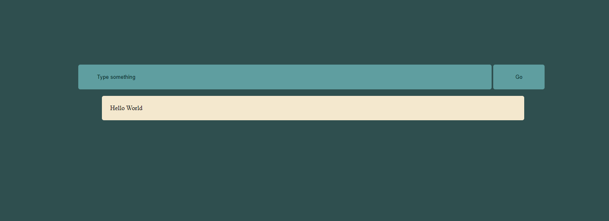

# JavaScript Practice Repository

This repository contains several small projects and practice cases demonstrating various JavaScript concepts. These projects were developed as part of my learning journey at BeCode. 

### All projects use HTML, CSS, and JavaScript.

# Contents

## SecondsPassed:
 A simple webpage that displays the number of seconds and minutes that have passed since the page was opened. This project demonstrates the use of setInterval to update the page at regular intervals.

## Typewriter:
 This project emulates a typewriter. The user enters text into an input field and clicks a button. The entered text is then displayed in a section of the page, one character at a time, to emulate the process of typing on a typewriter. This project demonstrates the use of setTimeout to create delays in JavaScript.

## Whack-A-Mole:
 A simple, fun game where moles appear at random in different holes and the user has to click on them to score points. This project demonstrates the use of event listeners in JavaScript, as well as setInterval and setTimeout.
 ## Live : [Whack-a-mole!](https://simple-whack-a-mole-sf.netlify.app/)

## Recursion Practice:
 This directory contains practice cases demonstrating the use of recursion in JavaScript, including examples of setInterval and setTimeout.

Acknowledgements
A big thanks to BeCode for providing the learning and practice opportunities that made these projects possible.
